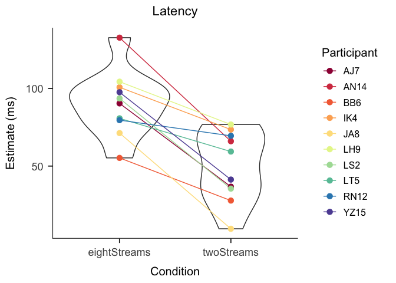
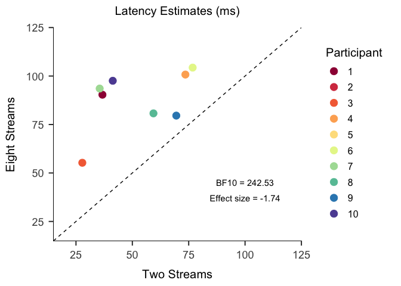
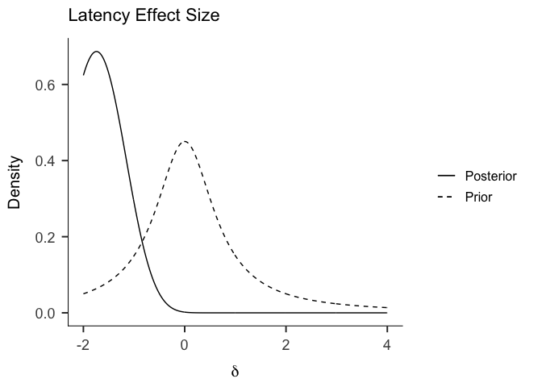
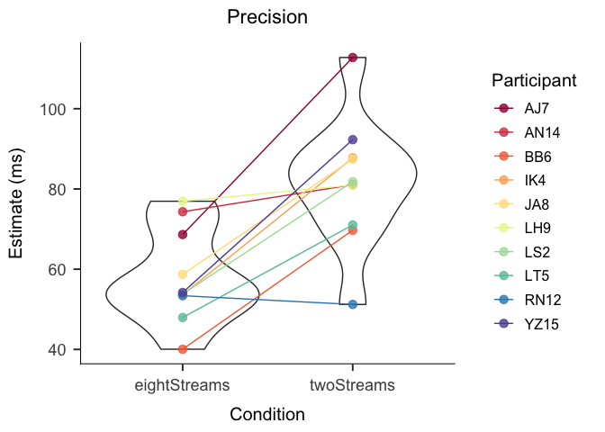
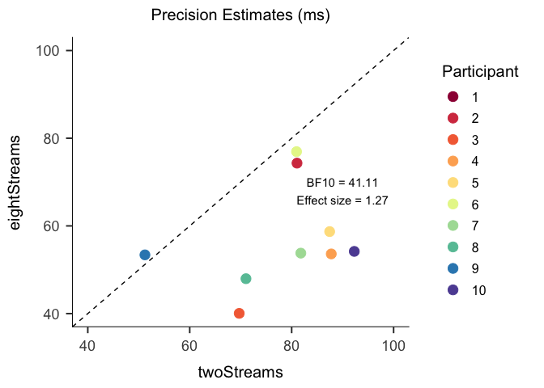

nStreams Analysis
================
Charlie Ludowici
5/18/2017

``` r
library(ggplot2)
library(reshape2)
library(papaja)
theme_set(theme_apa(base_size = 15) ) 

savePlots <- T

posterior <- function(t, N1, N2=NULL, delta, lo=-Inf, hi = Inf,
                      priorMean=0,priorSD=1) {
        N = ifelse(is.null(N2), N1, N1*N2/(N1+N2))
        df  = ifelse(is.null(N2), N1 - 1, N1 + N2 - 2)
        
        #prior and likelihood
        #prior <- function(delta) dnorm(delta, priorMean, priorSD)*as.integer(delta >= lo)*as.integer(delta <= hi) 
        prior <- function(delta) dcauchy(delta, priorMean, priorSD)*as.integer(delta >= lo)*as.integer(delta <= hi) 
        K=1/integrate(prior,lower=lo,upper=hi)[[1]]
        f=function(delta) K*prior(delta)
        
        #(The as.integer bits above just provide bounds for the prior if you want them)
      
        likelihood <- function(delta) dt(t, df, delta*sqrt(N))
        
        #marginal likelihood
        marginal <- integrate(function(x) f(x)*likelihood(x), lo, hi)[[1]]
        
        #posterior
        post <- function(x) f(x)*likelihood(x) / marginal
        return(post(delta))
}
```

``` r
null = 0

MMlatency <- read.csv('../modelOutput/CSV/TGRSVP_Exp2_LatencyNorm.csv')
MMprecision <- read.csv('../modelOutput/CSV/TGRSVP_Exp2_precisionNorm.csv')
MMefficacy <- read.csv('../modelOutput/CSV/TGRSVP_Exp2_efficacyNorm.csv')

latency <- data.frame(twoStreams = MMlatency$SingleLeft[MMlatency$Group == 1], eightStreams = MMlatency$SingleLeft[MMlatency$Group == 2])

precision <- data.frame(twoStreams = MMprecision$SingleLeft[MMprecision$Group == 1], eightStreams = MMprecision$SingleLeft[MMprecision$Group == 2])

efficacy <- data.frame(twoStreams = MMefficacy$SingleLeft[MMefficacy$Group == 1], eightStreams = MMefficacy$SingleLeft[MMefficacy$Group == 2])

frequentistTestLatency = t.test(x = latency$eightStreams, y=latency$twoStreams, paired = T)
tLatency <- frequentistTestLatency$statistic[[1]]
frequentistTestLatency
```

    ## 
    ##  Paired t-test
    ## 
    ## data:  latency$eightStreams and latency$twoStreams
    ## t = 6.429, df = 9, p-value = 0.0001211
    ## alternative hypothesis: true difference in means is not equal to 0
    ## 95 percent confidence interval:
    ##  26.57040 55.42028
    ## sample estimates:
    ## mean of the differences 
    ##                40.99534

Latency Analyses
================

``` r
latencyForPlot <- melt(latency, measure.vars = c('twoStreams','eightStreams'),variable.name = 'Condition', value.name = 'Estimate')
latencyForPlot$Participant <- ordered(rep(1:10, times = 2))

latencyPlot <- ggplot(latencyForPlot,aes(x=Condition, y=Estimate))+
  geom_violin()+
  geom_line(aes(group=Participant, colour=Participant))+
  geom_point(aes(colour=Participant), size = 3)+
  scale_colour_brewer(palette = 'Spectral')+
  labs(x='Condition',y='Estimate (ms)',title='Latency')+
  theme(plot.title = element_text(hjust=.5))

show(latencyPlot)
```


``` r
latencyScatter <- ggplot(latency, aes(x=twoStreams, y=eightStreams))+
  geom_point(size = 4, aes(colour=ordered(1:10)))+
  scale_color_brewer(palette='Spectral', name='Participant')+
  lims(x=c(20,120), y=c(20,120))+
  labs(title='Latency Estimates (ms)', x = 'Two Streams', y='Eight Streams')+
  theme(plot.title = element_text(size=15, hjust=.5))+
  geom_abline(intercept = 0, slope = 1,linetype='dashed')

show(latencyScatter)
```


``` r
t  <- tLatency
N1 <- 10
N2 <- 10

priorMean = null
priorSD = sqrt(.5)

#examples of BF via savage-dickey ratio
#2-sided
BF10 = dcauchy(null,priorMean,priorSD) / posterior(tLatency, N1, delta=null,
                                              priorMean=priorMean,priorSD=priorSD)

#one-sided BF
BFplus = ( 2 * dcauchy(null,priorMean,priorSD) ) / posterior(tLatency, N1, delta=null, lo=0,
                                            priorMean=priorMean,priorSD=priorSD)

BF10
```

    ## [1] 242.5299

``` r
BFplus
```

    ## [1] 484.9676

``` r
delta  <- seq(-2, 4, .01)

posteriorAndPriorDF <- data.frame(delta = delta, posterior = posterior(t,N1,delta=delta, priorMean=priorMean,priorSD=priorSD), prior = dcauchy(delta, priorMean,priorSD))

posteriorModeLatency <- optimize(function(delta) posterior(tLatency, N1, delta=delta, priorMean=priorMean, priorSD=priorSD), interval=c(-4,4),maximum = T)[[1]]

#This would only work for normal, we use Cauchy!
#credibleIntervalDensityLower <- mean(posteriorAndPriorDF$posterior)-sd(posteriorAndPriorDF$posterior)*1.96
#credibleIntervalDensityUpper <- mean(posteriorAndPriorDF$posterior)+sd(posteriorAndPriorDF$posterior)*1.96


ggplot(posteriorAndPriorDF, aes(x=delta))+
  geom_line(aes(y=posterior, linetype = 'Posterior'))+
  geom_line(aes(y=prior, linetype = 'Prior'))+
  scale_linetype_manual(values = c('solid','dashed'),  guide = 'legend', name = NULL)+
  labs(x = expression(delta), y='Density')
```


Precision Analysis
==================

``` r
precisionForPlot <- melt(precision, measure.vars = c('twoStreams','eightStreams'),variable.name = 'Condition', value.name = 'Estimate')
precisionForPlot$Participant <- ordered(rep(1:10, times = 2))

precisionPlot <- ggplot(precisionForPlot,aes(x=Condition, y=Estimate))+
  geom_violin()+
  geom_line(aes(group=Participant, colour=Participant))+
  geom_point(aes(colour=Participant),alpha=.8, size = 3)+
  scale_colour_brewer(palette = 'Spectral')+
  labs(x='Condition',y='Estimate (ms)',title='Precision')+
  theme(plot.title = element_text(hjust=.5))

show(precisionPlot)
```



``` r
precisionScatter <- ggplot(precision, aes(x=twoStreams, y=eightStreams, colour=ordered(1:10)))+
  geom_point(size = 4)+
  scale_color_brewer(palette='Spectral', name='Participant')+
  lims(x=c(40,100), y=c(40,100))+
  labs(title='Precision Estimates (ms)')+
  theme(plot.title = element_text(size=15, hjust=.5))+
  geom_abline(intercept = 0, slope = 1,linetype='dashed')

show(precisionScatter)
```



``` r
frequentistTestPrecision <- t.test(x = precision$eightStreams, y = precision$twoStreams, paired = T)
tPrecision <- frequentistTestPrecision$statistic[[1]]

t  <- tPrecision
N1 <- 10
N2 <- 10

priorMean =0
priorSD = sqrt(.5)

#examples of BF via savage-dickey ratio
#2-sided
BF10 = dcauchy(0,priorMean,priorSD) / posterior(tPrecision, N1, delta=0,
                                              priorMean=priorMean,priorSD=priorSD)

#one-sided BF
BFplus = ( 2 * dcauchy(0,priorMean,priorSD) ) / posterior(tPrecision, N1, delta=0, lo=0,
                                            priorMean=priorMean,priorSD=priorSD)

BF10
```

    ## [1] 41.11226

``` r
BFplus
```

    ## [1] 0.09697912

``` r
delta  <- seq(-4, 2, .01)

posteriorModePrecision <- optimize(function(delta) posterior(tPrecision, N1, delta=delta,priorMean=priorMean,priorSD=priorSD), interval=c(-4,4),maximum = T)[[1]]

posteriorAndPriorDF <- data.frame(delta = delta, posterior = posterior(t,N1,delta=delta,
                                                                       priorMean=priorMean,priorSD=priorSD), prior = dcauchy(delta, priorMean,priorSD))

posteriorModeEfficacy <- optimize(function(delta) posterior(tLatency, N1, delta=delta, priorMean=priorMean, priorSD=priorSD), interval=c(-4,4),maximum = T)[[1]]

ggplot(posteriorAndPriorDF, aes(x=delta))+
  geom_line(aes(y=posterior, linetype = 'Posterior'))+
  geom_line(aes(y=prior, linetype = 'Prior'))+
  scale_linetype_manual(values = c('solid','dashed'),  guide = 'legend', name = NULL)+
  labs(x = expression(delta), y='Density')
```



Efficacy Analysis
=================

``` r
frequentistTestEfficacy <- t.test(x = efficacy$eightStreams, y = efficacy$twoStreams, paired = T)
tEfficacy <- frequentistTestEfficacy$statistic[[1]]

efficacyForPlot <- melt(efficacy, measure.vars = c('twoStreams','eightStreams'), variable.name = 'Condition',value.name = 'Estimate')
efficacyForPlot$Participant <- ordered(rep(1:10, times = 2))


efficacyPlot <- ggplot(efficacyForPlot, aes(x=Condition, y=Estimate))+
  geom_violin()+
  geom_line(aes(group=Participant, colour=Participant))+
  geom_point(aes(colour = Participant), size = 3)+
  labs(x='Condition',y='Estimate',title='Efficacy')+
  theme(plot.title = element_text(hjust=.5))+
  scale_colour_brewer(palette = 'Spectral')

show(efficacyPlot)
```



``` r
efficacyScatter <- ggplot(efficacy, aes(x=twoStreams, y=eightStreams, colour=ordered(1:10)))+
  geom_point(size = 4)+
  scale_color_brewer(palette='Spectral', name='Participant')+
  lims(x=c(0,1), y=c(0,1))+
  labs(title='Efficacy Estimates', y = 'Eight Streams', y='Eight Streams')+
  theme(plot.title = element_text(size=15, hjust=.5))+
  geom_abline(intercept = 0, slope = 1,linetype='dashed')

show(efficacyScatter)
```



``` r
t  <- tEfficacy
N1 <- 10
N2 <- 10

priorMean =0
priorSD = sqrt(.5)

#examples of BF via savage-dickey ratio
#2-sided
BF10 = dcauchy(0,priorMean,priorSD) / posterior(tEfficacy, N1, delta=0,
                                              priorMean=priorMean,priorSD=priorSD)

#one-sided BF
BFplus = ( 2 * dcauchy(0,priorMean,priorSD) ) / posterior(tEfficacy, N1, delta=0, lo=0,
                                            priorMean=priorMean,priorSD=priorSD)

BF10
```

    ## [1] 0.3755812

``` r
BFplus
```

    ## [1] 0.5468815

``` r
delta  <- seq(-2, 4, .01)

posteriorAndPriorDF <- data.frame(delta = delta, posterior = posterior(t,N1,delta=delta,
                                                                       priorMean=priorMean,priorSD=priorSD), prior = dcauchy(delta, priorMean,priorSD))
ggplot(posteriorAndPriorDF, aes(x=delta))+
  geom_line(aes(y=posterior, linetype = 'Posterior'))+
  geom_line(aes(y=prior, linetype = 'Prior'))+
  scale_linetype_manual(values = c('solid','dashed'),  guide = 'legend', name = NULL)+
  labs(x = expression(delta), y='Density')
```


``` r
if(savePlots){
  ggsave(precisionPlot, file = 'precisionViolin.png', height=15, width=20,units='cm')
  ggsave(latencyPlot, file = 'latencyViolin.png', height=15, width=20,units='cm')
  ggsave(efficacyPlot, file = 'efficacyViolin.png', height=15, width=20,units='cm')
  
  ggsave(precisionScatter, file = 'precisionScatter.png', height=15, width=20,units='cm')
  ggsave(latencyScatter, file = 'latencyScatter.png', height=15, width=20,units='cm')
  ggsave(efficacyScatter, file = 'efficacyScatter.png', height=15, width=20,units='cm')
}
```

    ## Warning: Removed 1 rows containing missing values (geom_point).

    ## Warning: Removed 2 rows containing missing values (geom_point).
