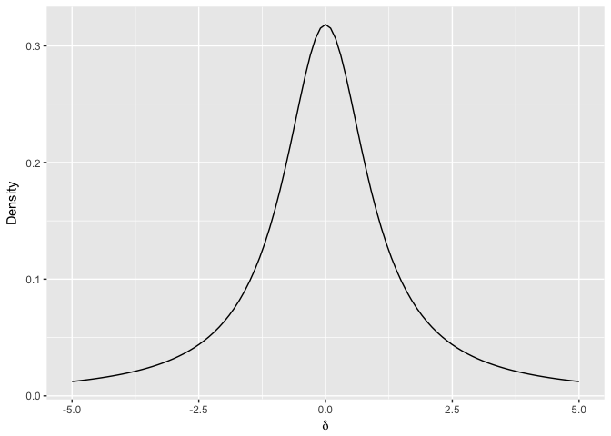
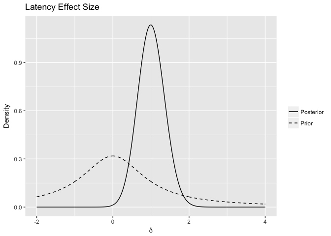
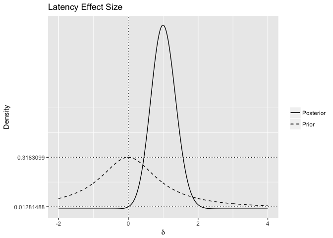

Savage-Dickey
================
Charlie Ludowici
15 November 2017

-   When investigating a model where the parameter of interest is fixed (i.e. H0: mu = 0, the point null) and one where the parameter is free to vary (i.e. H1: mu ≠ 0). We can obtain H0 from H1 by setting the parameter of interest to the the fixed value.
    -   The fact that these models are nested allows us to us the Savage-Dickey ratio (Wagenmakers et al., 2010).
-   The classic Bayesian approach to comparing these models computes the posteriors for both these models. The ratio of the posteriors gives us the Bayes factor.
-   The Savage-Dickey density ratio allows us to obtain the Bayes factor by only considering H1. The ratio is the comparison between the height of the posterior at the point of interest (in this case, 0) and the height of the prior at that point. This ratio is the same as the Bayes factor computed from the classic approach.

Our nStreams Analyses
---------------------

We use a Cauchy prior over effect size where location = 0 and scale = 1.



I'll compute a Bayes factor using the latency data from the most recent experiment (precued streams).

``` r
MMlatency <- read.csv('../modelOutput/CSV/TGRSVP_Exp2_LatencyNorm.csv')

latency <- data.frame(twoStreams = MMlatency$SingleLeft[MMlatency$Group == 1], eightStreams = MMlatency$SingleLeft[MMlatency$Group == 2])
latency <- latency[complete.cases(latency),]
latency$participant <- factor(1:nParticipants)

frequentistTestLatency = t.test(x = latency$eightStreams, y=latency$twoStreams, paired = T)
tLatency <- frequentistTestLatency$statistic[[1]] #the t-value relates to the likelihood function somehow, but I can't find the reference that explained this

delta  <- seq(-2, 4, .01) #a vector of effect sizes for the plot

posteriorAndPriorDF <- data.frame(delta = delta, posterior = posterior(t = tLatency,N1 = nParticipants,delta=delta, priorMean=0,priorSD=1), prior = dcauchy(delta, 0,1)) #data.frame for the plot

latencyBayesPlot <- ggplot(posteriorAndPriorDF, aes(x=delta))+
  geom_line(aes(y=posterior, linetype = 'Posterior'))+
  geom_line(aes(y=prior, linetype = 'Prior'))+
  scale_linetype_manual(values = c('solid','dashed'),  guide = 'legend', name = NULL)+
  labs(x = expression(delta), y='Density', title = 'Latency Effect Size')

show(latencyBayesPlot)
```



Great, so we have posterior and prior distributions. What's the height of the prior at an effect size of zero?

``` r
priorAtZero <- posteriorAndPriorDF$prior[posteriorAndPriorDF$delta==0]
print(priorAtZero)
```

    ## [1] 0.3183099

What's the height of the posterior at the same point?

``` r
posteriorAtZero <- posteriorAndPriorDF$posterior[posteriorAndPriorDF$delta==0]
print(posteriorAtZero)
```

    ## [1] 0.01281488

``` r
latencyBayesPlot <- ggplot(posteriorAndPriorDF, aes(x=delta))+
  geom_line(aes(y=posterior, linetype = 'Posterior'))+
  geom_line(aes(y=prior, linetype = 'Prior'))+
  scale_linetype_manual(values = c('solid','dashed'),  guide = 'legend', name = NULL)+
  geom_hline(yintercept = 0.01281488, linetype = 3)+
  geom_hline(yintercept =  0.3183099, linetype = 3)+
  geom_vline(xintercept = 0, linetype=3)+
  scale_y_continuous(breaks = c(0.01281488,0.3183099), labels = c(0.01281488,0.3183099))+
  labs(x = expression(delta), y='Density', title = 'Latency Effect Size')

show(latencyBayesPlot)
```



Thus our Bayes factor is 24.8390879. The alternative is 25 times more likely than the null. There is a difference in mean latency between the two-streams precued and eight-streams precued conditions.

``` r
print( priorAtZero/posteriorAtZero)
```

    ## [1] 24.83909

Bibliography
------------

Wagenmakers, E.-J., Lodewyckx, T., Kuriyal, H., & Grasman, R. (2010). Bayesian hypothesis testing for psychologists: A tutorial on the Savage–Dickey method. Cognitive Psychology, 60(3), 158–189.
