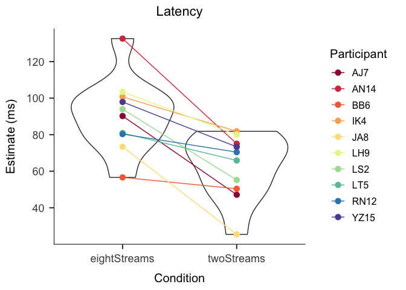
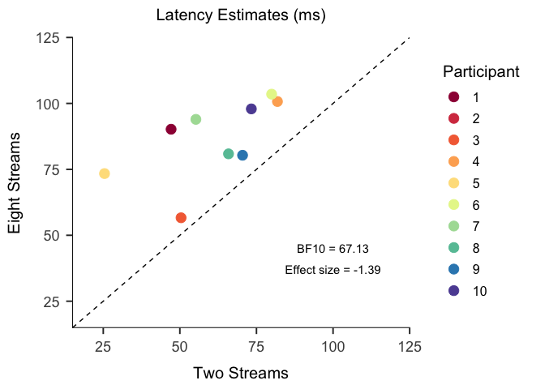
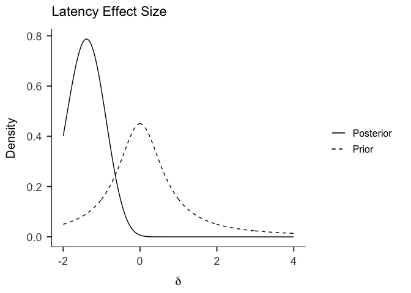
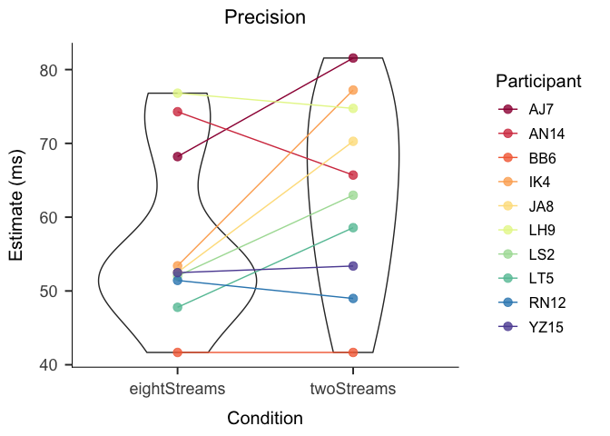
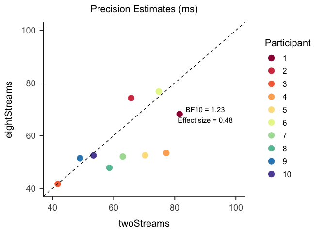
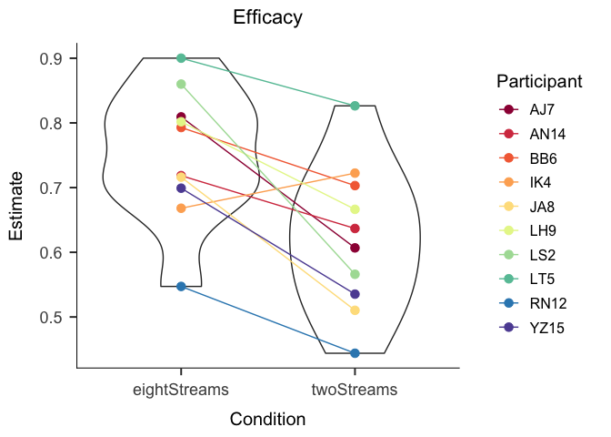
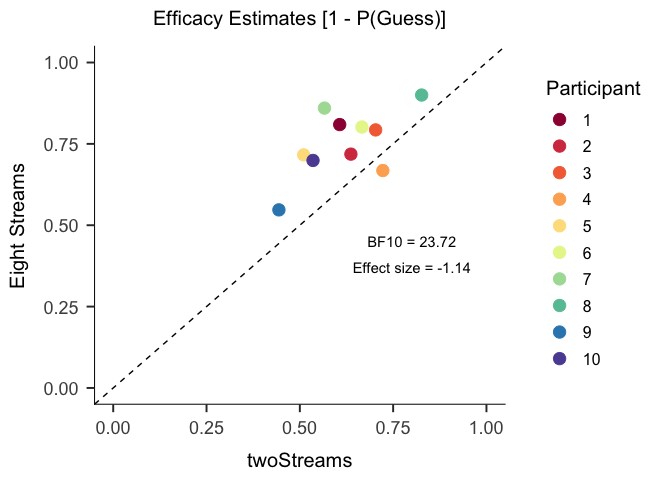

nStreams Analysis (truncNorm)
================
Charlie Ludowici
5/18/2017

``` r
library(ggplot2)
library(reshape2)
library(papaja)
library(dplyr)
```

    ## 
    ## Attaching package: 'dplyr'

    ## The following objects are masked from 'package:stats':
    ## 
    ##     filter, lag

    ## The following objects are masked from 'package:base':
    ## 
    ##     intersect, setdiff, setequal, union

``` r
library(magrittr)
library(BayesFactor)
```

    ## Loading required package: coda

    ## Loading required package: Matrix

    ## ************
    ## Welcome to BayesFactor 0.9.12-4.2. If you have questions, please contact Richard Morey (richarddmorey@gmail.com).
    ## 
    ## Type BFManual() to open the manual.
    ## ************

``` r
theme_set(theme_apa(base_size = 15) ) 

inclusionBF <- function(model, variable){
  
  ###https://www.cogsci.nl/blog/interpreting-bayesian-repeated-measures-in-jasp###

  
  priorProbs <- model %>% newPriorOdds() %>% `*`(model) %>% as.BFprobability() %>% as.vector() 
  
  theseNames <- names(priorProbs)
  nProbs <- 1:length(priorProbs)
  variableMatches <- grep(variable, theseNames)
  
  if(grepl(':', variable)){
    subordinateVariables <- variable %>% strsplit(':') %>% unlist()
    
    thisRegex <- paste0(subordinateVariables,collapse = '.*\\+.*')
    
    subordinateEffects <- grep(thisRegex, theseNames, perl = T)
    subordinateEffects <- subordinateEffects[!subordinateEffects %in% variableMatches]
    
    
    sum(priorProbs[variableMatches])/sum(priorProbs[subordinateEffects])
  } else {
    interactionMatches <- grep(paste0(variable,'(?=:)|(?<=:)',variable), theseNames, perl = T)
    
    variableMainEffects <- variableMatches[!variableMatches %in% interactionMatches]
    
    
    otherMainEffects <- nProbs[!nProbs %in% c(variableMainEffects,interactionMatches)]
    
    
    sum(priorProbs[variableMainEffects])/sum(priorProbs[otherMainEffects])
  }
}

savePlots <- T

posterior <- function(t, N1, N2=NULL, delta, lo=-Inf, hi = Inf,
                      priorMean=0,priorSD=1) {
        N = ifelse(is.null(N2), N1, N1*N2/(N1+N2))
        df  = ifelse(is.null(N2), N1 - 1, N1 + N2 - 2)
        
        #prior and likelihood
        #prior <- function(delta) dnorm(delta, priorMean, priorSD)*as.integer(delta >= lo)*as.integer(delta <= hi) 
        prior <- function(delta) dcauchy(delta, priorMean, priorSD)*as.integer(delta >= lo)*as.integer(delta <= hi) 
        K=1/integrate(prior,lower=lo,upper=hi)[[1]]
        f=function(delta) K*prior(delta)
        
        #(The as.integer bits above just provide bounds for the prior if you want them)
      
        likelihood <- function(delta) dt(t, df, delta*sqrt(N))
        
        #marginal likelihood
        marginal <- integrate(function(x) f(x)*likelihood(x), lo, hi)[[1]]
        
        #posterior
        post <- function(x) f(x)*likelihood(x) / marginal
        return(post(delta))
}
```

``` r
null = 0

LatencyNorm <- read.csv('../modelOutput/CSV/TGRSVP_Exp2_LatencyNorm.csv')
LatencyTNorm <- read.csv('../modelOutput/CSV/TGRSVP_Exp2_LatencyTruncNorm.csv')

PrecisionNorm <- read.csv('../modelOutput/CSV/TGRSVP_Exp2_PrecisionNorm.csv')
PrecisionTNorm <- read.csv('../modelOutput/CSV/TGRSVP_Exp2_PrecisionTruncNorm.csv')

EfficacyNorm <- read.csv('../modelOutput/CSV/TGRSVP_Exp2_EfficacyNorm.csv')
EfficacyTNorm <- read.csv('../modelOutput/CSV/TGRSVP_Exp2_EfficacyTruncNorm.csv')
```

Model fits
==========

``` r
BFs <- read.csv('../modelOutput/BF_ByParticipant.csv', header = T)
BFs %>% filter(Group == 'twoStreams') %>% pull(BF) %>% sort()
```

    ##  [1] 1.403833e+00 1.475233e+02 2.649419e+03 1.033721e+04 2.947341e+05
    ##  [6] 8.565688e+05 2.142525e+06 8.395087e+08 1.629370e+10 1.075587e+16

Latency Analyses
================

``` r
latencyTwo <- LatencyTNorm %>% filter(Group == 'twoStreams') %>% pull(Estimate)
latencyEight <- LatencyTNorm %>% filter(Group == 'eightStreams') %>% pull(Estimate)

latencyTFreq  <- t.test(x = latencyTwo,
                        y = latencyEight, 
                        paired = T)

tLatency <- latencyTFreq$statistic[[1]]

N1 <- 10
N2 <- 10

priorMean = null
priorSD = sqrt(.5)

#examples of BF via savage-dickey ratio
#2-sided
BF10 = dcauchy(null,priorMean,priorSD) / posterior(tLatency, N1, delta=null,
                                              priorMean=priorMean,priorSD=priorSD)

#one-sided BF
BFplus = ( 2 * dcauchy(null,priorMean,priorSD) ) / posterior(tLatency, N1, delta=null, lo=0,
                                            priorMean=priorMean,priorSD=priorSD)

BF10
```

    ## [1] 67.13234

``` r
BFplus
```

    ## [1] 0.09531806

``` r
delta  <- seq(-2, 4, .01)

posteriorAndPriorDF <- data.frame(
  delta = delta, 
  posterior = posterior(tLatency,N1,delta=delta, priorMean=priorMean,priorSD=priorSD), 
  prior = dcauchy(delta, priorMean,priorSD))

posteriorModeLatency <- optimize(function(delta) posterior(tLatency, N1, delta=delta, priorMean=priorMean, priorSD=priorSD), 
                                 interval=c(-4,4),
                                 maximum = T)[[1]]

#This would only work for normal, we use Cauchy!
#credibleIntervalDensityLower <- mean(posteriorAndPriorDF$posterior)-sd(posteriorAndPriorDF$posterior)*1.96
#credibleIntervalDensityUpper <- mean(posteriorAndPriorDF$posterior)+sd(posteriorAndPriorDF$posterior)*1.96


LatencyTNormPlot <- ggplot(LatencyTNorm,aes(x=Group, y=Estimate))+
  geom_violin()+
  geom_line(aes(group=Participant, colour=Participant))+
  geom_point(aes(colour=Participant), size = 3)+
  scale_colour_brewer(palette = 'Spectral')+
  labs(x='Condition',y='Estimate (ms)',title='Latency')+
  theme(plot.title = element_text(hjust=.5))

show(LatencyTNormPlot)
```



``` r
wideFormatLatency <- dcast(data=LatencyTNorm,formula = Participant~Group)
```

    ## Using Estimate as value column: use value.var to override.

``` r
LatencyTNormScatter <- ggplot(wideFormatLatency, aes(x=twoStreams, y=eightStreams))+
  geom_point(size = 4, aes(colour=ordered(1:10)))+
  scale_color_brewer(palette='Spectral', name='Participant')+
  lims(x=c(20,120), y=c(20,120))+
  labs(title='Latency Estimates (ms)', x = 'Two Streams', y='Eight Streams')+
  theme(plot.title = element_text(size=15, hjust=.5))+
  annotate('text', x=100, y=45, label = paste0('BF10 = ', round(BF10,2)))+
  annotate('text', x = 100, y=37, label = paste0('Effect size = ', round(posteriorModeLatency,2)))+
  geom_abline(intercept = 0, slope = 1,linetype='dashed')

show(LatencyTNormScatter)
```



``` r
LatencyTNormBayesPlot <- ggplot(posteriorAndPriorDF, aes(x=delta))+
  geom_line(aes(y=posterior, linetype = 'Posterior'))+
  geom_line(aes(y=prior, linetype = 'Prior'))+
  scale_linetype_manual(values = c('solid','dashed'),  guide = 'legend', name = NULL)+
  labs(x = expression(delta), y='Density', title = 'Latency Effect Size')

show(LatencyTNormBayesPlot)
```



Precision Analysis
==================

``` r
precisionTwo <- PrecisionTNorm %>% filter(Group == 'twoStreams') %>% pull(Estimate)
precisionEight <- PrecisionTNorm %>% filter(Group == 'eightStreams') %>% pull(Estimate)

precisionTFreq  <- t.test(x = precisionTwo,
                        y = precisionEight, 
                        paired = T)

tPrecision <- precisionTFreq$statistic[[1]]

t  <- tPrecision
N1 <- 10
N2 <- 10

priorMean =0
priorSD = sqrt(.5)

#examples of BF via savage-dickey ratio
#2-sided
BF10 = dcauchy(0,priorMean,priorSD) / posterior(tPrecision, N1, delta=0,
                                              priorMean=priorMean,priorSD=priorSD)

#one-sided BF
BFplus = ( 2 * dcauchy(0,priorMean,priorSD) ) / posterior(tPrecision, N1, delta=0, lo=0,
                                            priorMean=priorMean,priorSD=priorSD)

BF10
```

    ## [1] 1.234553

``` r
BFplus
```

    ## [1] 2.337992

``` r
delta  <- seq(-4, 2, .01)

posteriorModePrecision <- optimize(function(delta) posterior(tPrecision, N1, delta=delta,priorMean=priorMean,priorSD=priorSD), interval=c(-4,4),maximum = T)[[1]]

posteriorAndPriorDF <- data.frame(delta = delta, 
                                  posterior = posterior(tPrecision,N1,delta=delta,
                                                    priorMean=priorMean,priorSD=priorSD), 
                                  prior = dcauchy(delta, priorMean,priorSD))

posteriorModePrecision <- optimize(function(delta) posterior(tPrecision, N1, delta=delta, priorMean=priorMean, priorSD=priorSD), interval=c(-4,4),maximum = T)[[1]]


PrecisionTNormPlot <- ggplot(PrecisionTNorm,aes(x=Group, y=Estimate))+
  geom_violin()+
  geom_line(aes(group=Participant, colour=Participant))+
  geom_point(aes(colour=Participant),alpha=.8, size = 3)+
  scale_colour_brewer(palette = 'Spectral')+
  labs(x='Condition',y='Estimate (ms)',title='Precision')+
  theme(plot.title = element_text(hjust=.5))

show(PrecisionTNormPlot)
```



``` r
wideFormatPrecision <- dcast(data=PrecisionTNorm,formula = Participant~Group)
```

    ## Using Estimate as value column: use value.var to override.

``` r
PrecisionTNormScatter <- ggplot(wideFormatPrecision, aes(x=twoStreams, y=eightStreams, colour=ordered(1:10)))+
  geom_point(size = 4)+
  scale_color_brewer(palette='Spectral', name='Participant')+
  lims(x=c(40,100), y=c(40,100))+
  labs(title='Precision Estimates (ms)')+
  theme(plot.title = element_text(size=15, hjust=.5))+
  annotate('text', x=90, y=70, label = paste0('BF10 = ', round(BF10,2)))+
  annotate('text', x = 90, y=66, label = paste0('Effect size = ', round(posteriorModePrecision,2)))+
  geom_abline(intercept = 0, slope = 1,linetype='dashed')

show(PrecisionTNormScatter)
```



``` r
PrecisionTNormBayesPlot <- ggplot(posteriorAndPriorDF, aes(x=delta))+
  geom_line(aes(y=posterior, linetype = 'Posterior'))+
  geom_line(aes(y=prior, linetype = 'Prior'))+
  scale_linetype_manual(values = c('solid','dashed'),  guide = 'legend', name = NULL)+
  labs(x = expression(delta), y='Density', title = 'Precision Effect Size')
```

Efficacy Analysis
=================

``` r
efficacyTwo <- EfficacyTNorm %>% filter(Group == 'twoStreams') %>% pull(Estimate)
efficacyEight <- EfficacyTNorm %>% filter(Group == 'eightStreams') %>% pull(Estimate)

efficacyTFreq  <- t.test(x = efficacyTwo,
                        y = efficacyEight, 
                        paired = T)

tEfficacy <- efficacyTFreq$statistic[[1]]
N1 <- 10
N2 <- 10

priorMean =0
priorSD = sqrt(.5)

#examples of BF via savage-dickey ratio
#2-sided
BF10 = dcauchy(0,priorMean,priorSD) / posterior(tEfficacy, N1, delta=0,
                                              priorMean=priorMean,priorSD=priorSD)

#one-sided BF
BFplus = ( 2 * dcauchy(0,priorMean,priorSD) ) / posterior(tEfficacy, N1, delta=0, lo=0,
                                            priorMean=priorMean,priorSD=priorSD)

BF10
```

    ## [1] 23.71624

``` r
BFplus
```

    ## [1] 0.09925684

``` r
delta  <- seq(-2, 4, .01)

posteriorAndPriorDF <- data.frame(delta = delta, posterior = posterior(tEfficacy ,N1,delta=delta,
                                                                       priorMean=priorMean,priorSD=priorSD), prior = dcauchy(delta, priorMean,priorSD))

posteriorModeEfficacy <- optimize(function(delta) posterior(tEfficacy, N1, delta=delta,priorMean=priorMean,priorSD=priorSD), interval=c(-4,4),maximum = T)[[1]]


EfficacyTNormPlot <- ggplot(EfficacyTNorm, aes(x=Group, y=Estimate))+
  geom_violin()+
  geom_line(aes(group=Participant, colour=Participant))+
  geom_point(aes(colour = Participant), size = 3)+
  labs(x='Condition',y='Estimate',title='Efficacy')+
  theme(plot.title = element_text(hjust=.5))+
  scale_colour_brewer(palette = 'Spectral')

show(EfficacyTNormPlot)
```



``` r
wideFormatEfficacy <- dcast(data=EfficacyTNorm,formula = Participant~Group)
```

    ## Using Estimate as value column: use value.var to override.

``` r
EfficacyTNormScatter <- ggplot(wideFormatEfficacy, aes(x=twoStreams, y=eightStreams, colour=ordered(1:10)))+
  geom_point(size = 4)+
  scale_color_brewer(palette='Spectral', name='Participant')+
  lims(x=c(0,1), y=c(0,1))+
  labs(title='Efficacy Estimates [1 - P(Guess)]', y = 'Eight Streams', y='Eight Streams')+
  theme(plot.title = element_text(size=15, hjust=.5))+
  annotate('text', x=.8, y=.45, label = paste0('BF10 = ', round(BF10,2)))+
  annotate('text', x = .8, y=.37, label = paste0('Effect size = ', round(posteriorModeEfficacy,2)))+
  geom_abline(intercept = 0, slope = 1,linetype='dashed')

show(EfficacyTNormScatter)
```



``` r
EfficacyTNormBayesPlot <- ggplot(posteriorAndPriorDF, aes(x=delta))+
  geom_line(aes(y=posterior, linetype = 'Posterior'))+
  geom_line(aes(y=prior, linetype = 'Prior'))+
  scale_linetype_manual(values = c('solid','dashed'),  guide = 'legend', name = NULL)+
  labs(x = expression(delta), y='Density', title = 'Efficacy Effect Size')
```

``` r
# 
# EfficacyTNorm$Parameter <- as.character('Efficacy')
# LatencyTNorm$Parameter <- as.character('Latency')
# PrecisionTNorm$Parameter <- as.character('Precision')
# 
# allParams <- rbind(EfficacyTNorm,LatencyTNorm,PrecisionTNorm)
# 
# allParams <- melt(allParams, measure.vars = c('twoStreams','eightStreams'), variable.name = 'Condition',value.name = 'Estimate')
# 
# paramBar <- ggplot(allParams[!allParams$Parameter=='Efficacy',], aes(x=Parameter,y=Estimate, fill = Condition))+
#   stat_summary(geom='bar', fun.y = mean, position = position_dodge(.9))+
#   stat_summary(geom='errorbar', fun.data=mean_se, position = position_dodge(.9), width = .3)+
#   scale_fill_brewer(palette = 'Spectral')
# 
# paramBar
# 
# predictions <- data.frame(twoStreams = rnorm(1000, LatencyTNorm$twoStreams[7], PrecisionTNorm$twoStreams[7]), eightStreams = rnorm(1000, LatencyTNorm$eightStreams[7], PrecisionTNorm$eightStreams[7]))
# 
# predictions <- melt(predictions, measure.vars = c('twoStreams', 'eightStreams'), variable.name = 'Condition', value.name = 'response')
# 
# meanLatencyTwo <- mean(LatencyTNorm$twoStreams)
# meanLatencyEight <- mean(LatencyTNorm$eightStreams)
# 
# meanPrecisionTwo <- mean(PrecisionTNorm$twoStreams)
# meanPrecisionEight <- mean(PrecisionTNorm$eightStreams)
# 
# 
# predictionPlot <- ggplot()+
#   stat_function(data=data.frame(x=c(-400:400)/83.33), aes(x, fill = 'Eight Streams'), fun = dnorm, args = list(mean = meanLatencyEight/83.33, sd = meanPrecisionEight/83.33), geom='area', alpha = .9)+
#   stat_function(data=data.frame(x=c(-400:400)/83.33), aes(x, fill = 'Two Streams'), fun = dnorm, args = list(mean = meanLatencyTwo/83.33, sd = meanPrecisionTwo/83.33), geom='area', alpha = .9)+
#   scale_fill_manual(values=c('Two Streams' = '#628093', 'Eight Streams' = '#dca951'))+
#   scale_x_continuous(breaks = -3:4,limits = c(-3,4))+
#   labs(x='SPE', y=NULL, fill = 'Condition')
# 
# predictionPlot
# 
# 
# if(savePlots){
#   ggsave(PrecisionTNormPlot, file = 'PrecisionTNormViolin.png', height=15, width=20,units='cm')
#   ggsave(LatencyTNormPlot, file = 'LatencyTNormViolin.png', height=15, width=20,units='cm')
#   ggsave(EfficacyTNormPlot, file = 'EfficacyTNormViolin.png', height=15, width=20,units='cm')
#   
#   ggsave(PrecisionTNormScatter, file = 'PrecisionTNormScatter.png', height=15, width=20,units='cm')
#   ggsave(LatencyTNormScatter, file = 'LatencyTNormScatter.png', height=15, width=20,units='cm')
#   ggsave(EfficacyTNormScatter, file = 'EfficacyTNormScatter.png', height=15, width=20,units='cm')
#   
#   
#   ggsave(EfficacyTNormBayesPlot, file = 'EfficacyTNormEffectSize.png', height=15, width=20,units='cm')
#   ggsave(LatencyTNormBayesPlot, file = 'LatencyTNormEffectSize.png', height=15, width=20,units='cm')
#     ggsave(PrecisionTNormBayesPlot, file = 'PrecisionTNormEffectSize.png', height=15, width=20,units='cm')
# }
```
