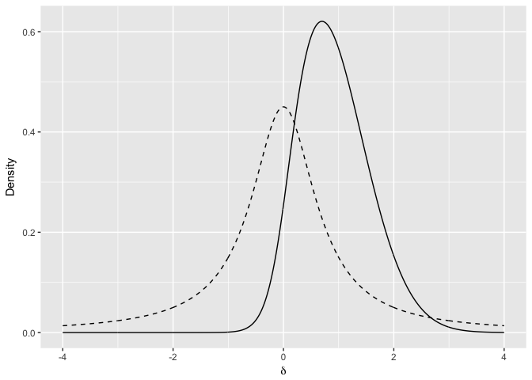
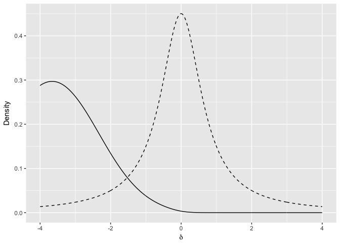

Pilot Bayesian
================
Charlie Ludowici
5/29/2017

``` r
library(ggplot2)
#pilot comparisons
rm(list=ls())

knitr::opts_chunk$set(warning=FALSE)

posterior <- function(t, N1, N2=NULL, delta, lo=-Inf, hi = Inf,
                      priorMean=0,priorSD=1) {
  N = ifelse(is.null(N2), N1, N1*N2/(N1+N2))
  df  = ifelse(is.null(N2), N1 - 1, N1 + N2 - 2)
  
  #prior and likelihood
  #prior <- function(delta) dnorm(delta, priorMean, priorSD)*as.integer(delta >= lo)*as.integer(delta <= hi) 
  prior <- function(delta) dcauchy(delta, priorMean, priorSD)*as.integer(delta >= lo)*as.integer(delta <= hi) 
  K=1/integrate(prior,lower=lo,upper=hi)[[1]]
  f=function(delta) K*prior(delta)
  
  #(The as.integer bits above just provide bounds for the prior if you want them)
  
  likelihood <- function(delta) dt(t, df, delta*sqrt(N))
  
  #marginal likelihood
  marginal <- integrate(function(x) f(x)*likelihood(x), lo, hi)[[1]]
  
  #posterior
  post <- function(x) f(x)*likelihood(x) / marginal
  return(post(delta))
}

priorLocation <- 0
priorScale <- sqrt(.5)

null <- 0
```

``` r
MMprecision <- read.csv('../modelOutput/CSV/TGRSVP_Exp2_precisionNorm.csv')
precisionEndogenous = MMprecision$SingleLeft[MMprecision$Group==3]
precisionEndogenous <- precisionEndogenous[-(1:2)] #drop alex and I so we can do within subjects
precisionExogenous = MMprecision$SingleLeft[MMprecision$Group==4]

t <- t.test(precisionEndogenous, precisionExogenous, var.equal = T, paired = T)

tIndependent <- t$statistic[[1]]

precisionPosterior <- posterior(t=tIndependent,N1 =  4, delta = null,priorMean = priorLocation, priorSD = priorScale)

prior <- dcauchy(null, priorLocation, priorScale)

BF10Precision <- prior/precisionPosterior

delta <- seq(-4,4,.01)

priorAndPosteriorPrecision <- data.frame(delta = delta, prior = dcauchy(delta, priorLocation, priorScale), posterior=posterior(t=tIndependent,N1 = 4, delta = delta,priorMean = priorLocation, priorSD = priorScale))

precisionPlot <- ggplot(priorAndPosteriorPrecision, aes(x=delta))+
  geom_line(aes(y=prior), linetype='dashed')+
  geom_line(aes(y=posterior), linetype = 'solid')+
  labs(x=expression(delta), y='Density')

show(precisionPlot)
```



``` r
MMlatency <- read.csv('../modelOutput/CSV/TGRSVP_Exp2_latencyNorm.csv')
latencyEndogenous = MMlatency$SingleLeft[MMlatency$Group==3]
latencyEndogenous <- latencyEndogenous[-(1:2)] #drop alex and I so we can do within subjects
latencyExogenous = MMlatency$SingleLeft[MMlatency$Group==4]

t <- t.test(latencyEndogenous, latencyExogenous, var.equal = T, paired = T)

tIndependent <- t$statistic[[1]]

latencyPosterior <- posterior(t=tIndependent,N1 = 4, delta = null,priorMean = priorLocation, priorSD = priorScale)

prior <- dcauchy(null, priorLocation, priorScale)

BF10Latency <- prior/latencyPosterior

delta <- seq(-4,40,.01)

priorAndPosteriorLatency <- data.frame(delta = delta, prior = dcauchy(delta, priorLocation, priorScale), posterior=posterior(t=tIndependent,N1 =  4, delta = delta,priorMean = priorLocation, priorSD = priorScale))

latencyPlot <- ggplot(priorAndPosteriorLatency, aes(x=delta))+
  geom_line(aes(y=prior), linetype='dashed')+
  geom_line(aes(y=posterior), linetype = 'solid')+
  labs(x=expression(delta), y='Density')

show(latencyPlot)
```


``` r
MMefficacy <- read.csv('../modelOutput/CSV/TGRSVP_Exp2_efficacyNorm.csv')
efficacyEndogenous = MMefficacy$SingleLeft[MMefficacy$Group==3]
efficacyEndogenous <- efficacyEndogenous[-(1:2)] #drop alex and I so we can do within subjects
efficacyExogenous = MMefficacy$SingleLeft[MMefficacy$Group==4]

t <- t.test(efficacyEndogenous, efficacyExogenous, var.equal = T, paired=T)

tIndependent <- t$statistic[[1]]

efficacyPosterior <- posterior(t=tIndependent,N1 = 4, delta = null,priorMean = priorLocation, priorSD = priorScale)

prior <- dcauchy(null, priorLocation, priorScale)

BF10Efficacy <- prior/efficacyPosterior

delta <- seq(-4,4,.01)

priorAndPosteriorEfficacy <- data.frame(delta = delta, prior = dcauchy(delta, priorLocation, priorScale), posterior=posterior(t=tIndependent,N1 = 6, N2 = 4, delta = delta,priorMean = priorLocation, priorSD = priorScale))

efficacyPlot <- ggplot(priorAndPosteriorEfficacy, aes(x=delta))+
  geom_line(aes(y=prior), linetype='dashed')+
  geom_line(aes(y=posterior), linetype = 'solid')+
  labs(x=expression(delta), y='Density')

show(efficacyPlot)
```


