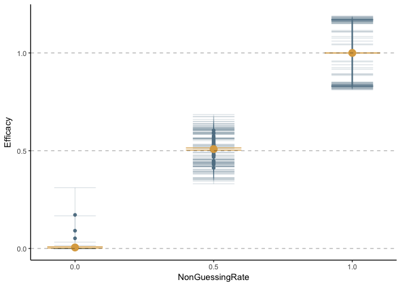
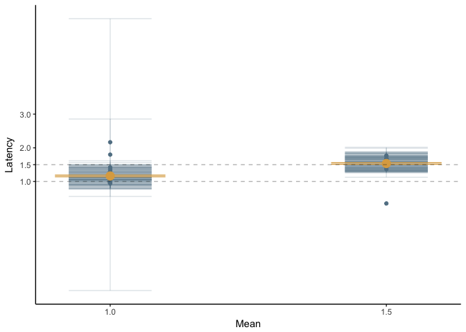
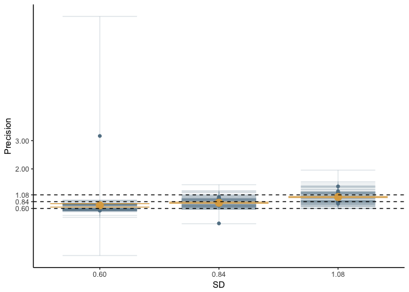
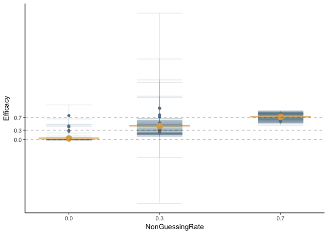
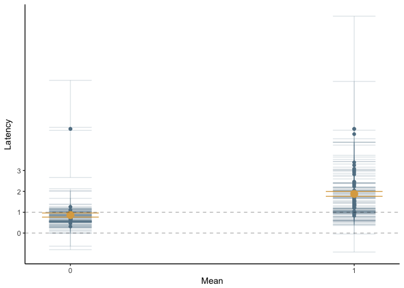
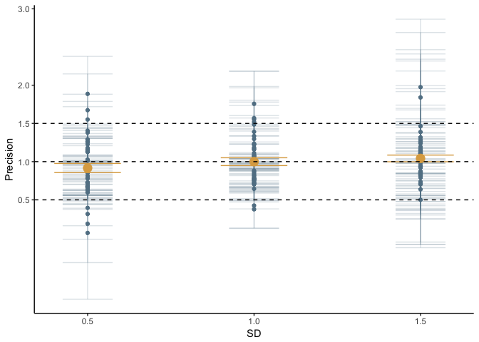
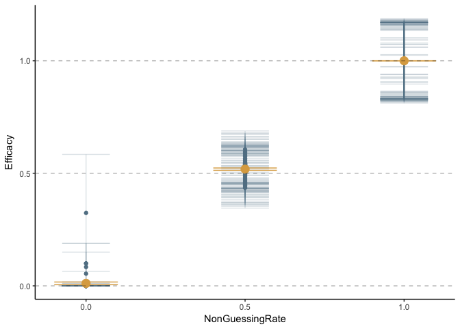
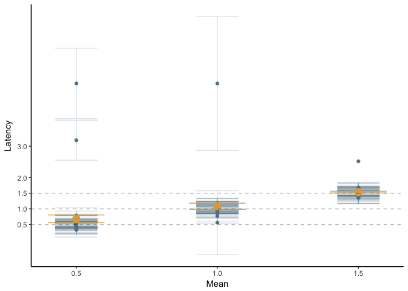
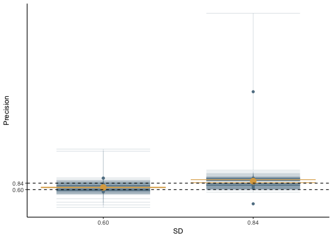

Model Recovery
================
Charlie Ludowici
8/8/2018

Truncated Normal
----------------

``` r
library(ggplot2)
rm(list = ls())
TNParamEstimates <- read.csv('~/gitCode/nStream/modellingScripts/Model recovery/EstimatesAndTruth/TruncNorm/estimatesAndTruthTruncNorm.csv', header = F)
TNParamLowerCI <- read.csv('~/gitCode/nStream/modellingScripts/Model recovery/EstimatesAndTruth/TruncNorm/estimatesAndTruthLowerBoundTruncNorm.csv', header = F)
TNParamUpperCI <- read.csv('~/gitCode/nStream/modellingScripts/Model recovery/EstimatesAndTruth/TruncNorm/estimatesAndTruthUpperBoundTruncNorm.csv', header = F)

colnames(TNParamEstimates) <-  c(
  'Participant',
  'NonGuessingRate',
  'Mean',
  'SD',
  'Efficacy',
  'Latency',
  'Precision'
)

colnames(TNParamLowerCI) <-  c(
  'Participant',
  'NonGuessingRate',
  'Mean',
  'SD',
  'EfficacyLower',
  'LatencyLower',
  'PrecisionLower'
)

colnames(TNParamUpperCI) <-  c(
  'Participant',
  'NonGuessingRate',
  'Mean',
  'SD',
  'EfficacyUpper',
  'LatencyUpper',
  'PrecisionUpper'
)

TNCIs <- cbind(TNParamLowerCI[,1:7], TNParamUpperCI[,5:7])


cor.test(TNParamEstimates$NonGuessingRate, TNParamEstimates$Efficacy)
```

    ## 
    ##  Pearson's product-moment correlation
    ## 
    ## data:  TNParamEstimates$NonGuessingRate and TNParamEstimates$Efficacy
    ## t = 188.16, df = 178, p-value < 2.2e-16
    ## alternative hypothesis: true correlation is not equal to 0
    ## 95 percent confidence interval:
    ##  0.9966391 0.9981342
    ## sample estimates:
    ##       cor 
    ## 0.9974957

``` r
ggplot(TNParamEstimates, aes(NonGuessingRate,Efficacy))+
  geom_point(colour = '#628093')+
  geom_errorbar(data=TNCIs, aes(NonGuessingRate, ymin = EfficacyLower, ymax=EfficacyUpper),alpha = .2, width = .15,  inherit.aes = F, colour = '#628093')+
  stat_summary(fun.y = 'mean', geom='point', size = 4, colour = '#dca951')+
  stat_summary(fun.data = 'mean_se', geom = 'errorbar', width = .2, colour = '#dca951')+
  scale_x_continuous(breaks = unique(TNParamEstimates$NonGuessingRate))+
  scale_y_continuous(breaks = unique(TNParamEstimates$NonGuessingRate))+
  geom_hline(yintercept = unique(TNParamEstimates$NonGuessingRate), linetype = 'dashed', alpha = .3)+
  theme(panel.background = element_blank(),axis.line = element_line(size = .5))
```



``` r
cor.test(TNParamEstimates$Mean, TNParamEstimates$Latency)
```

    ## 
    ##  Pearson's product-moment correlation
    ## 
    ## data:  TNParamEstimates$Mean and TNParamEstimates$Latency
    ## t = 11.352, df = 121, p-value < 2.2e-16
    ## alternative hypothesis: true correlation is not equal to 0
    ## 95 percent confidence interval:
    ##  0.6199456 0.7942187
    ## sample estimates:
    ##       cor 
    ## 0.7181606

``` r
ggplot(TNParamEstimates, aes(Mean,Latency))+
  geom_point(colour = '#628093')+
  geom_errorbar(data=TNCIs, aes(Mean, ymin = LatencyLower, ymax=LatencyUpper),alpha = .2, width = .15,  inherit.aes = F, colour = '#628093')+
  stat_summary(fun.y = 'mean', geom='point', size = 4, colour = '#dca951')+
  stat_summary(fun.data = 'mean_se', geom = 'errorbar', width = .2, colour = '#dca951')+
  scale_x_continuous(breaks = unique(TNParamEstimates$Mean))+
  scale_y_continuous(breaks = c(2:3, unique(TNParamEstimates$Mean)))+
  geom_hline(yintercept = unique(TNParamEstimates$Mean), linetype = 'dashed', alpha = .3)+
  theme(panel.background = element_blank(),axis.line = element_line(size = .5))
```



``` r
cor.test(TNParamEstimates$SD, TNParamEstimates$Precision)
```

    ## 
    ##  Pearson's product-moment correlation
    ## 
    ## data:  TNParamEstimates$SD and TNParamEstimates$Precision
    ## t = 5.2699, df = 121, p-value = 6.037e-07
    ## alternative hypothesis: true correlation is not equal to 0
    ## 95 percent confidence interval:
    ##  0.2761490 0.5658161
    ## sample estimates:
    ##       cor 
    ## 0.4320608

``` r
ggplot(TNParamEstimates, aes(SD,Precision))+
  geom_point(colour = '#628093')+
  geom_errorbar(data=TNCIs, aes(SD, ymin = PrecisionLower, ymax=PrecisionUpper),alpha = .2, width = .15,  inherit.aes = F, colour = '#628093')+
  stat_summary(fun.y = 'mean', geom='point', size = 4, colour = '#dca951')+
  stat_summary(fun.data = 'mean_se', geom = 'errorbar', width = .2, colour = '#dca951')+
  scale_x_continuous(breaks = unique(TNParamEstimates$SD))+
  scale_y_continuous(breaks = c(2:3, unique(TNParamEstimates$SD)))+
  geom_hline(yintercept = unique(TNParamEstimates$SD), linetype = 'dashed')+
  theme(panel.background = element_blank(),axis.line = element_line(size = .5))
```



Log Normal
----------

``` r
LNParamEstimates <- read.csv('~/gitCode/nStream/modellingScripts/Model recovery/EstimatesAndTruth/LogNorm/estimatesAndTruthLogNorm.csv', header = F)
LNParamLowerCI <- read.csv('~/gitCode/nStream/modellingScripts/Model recovery/EstimatesAndTruth/LogNorm/estimatesAndTruthLowerBoundLogNorm.csv', header = F)
LNParamUpperCI <- read.csv('~/gitCode/nStream/modellingScripts/Model recovery/EstimatesAndTruth/LogNorm/estimatesAndTruthUpperBoundLogNorm.csv', header = F)

colnames(LNParamEstimates) <-  c(
  'Participant',
  'NonGuessingRate',
  'Mean',
  'SD',
  'Shift',
  'Efficacy',
  'Latency',
  'Precision'
)

LNParamEstimates$Latency <- LNParamEstimates$Latency/(1000/12)
LNParamEstimates$Precision <- LNParamEstimates$Precision/(1000/12)

colnames(LNParamLowerCI) <-  c(
  'Participant',
  'NonGuessingRate',
  'Mean',
  'SD',
  'Shift',
  'EfficacyLower',
  'LatencyLower',
  'PrecisionLower'
)

colnames(LNParamUpperCI) <-  c(
  'Participant',
  'NonGuessingRate',
  'Mean',
  'SD',
  'Shift',
  'EfficacyUpper',
  'LatencyUpper',
  'PrecisionUpper'
)

LNCIs <- cbind(LNParamLowerCI[,1:8], LNParamUpperCI[,6:8])


cor.test(LNParamEstimates$NonGuessingRate, LNParamEstimates$Efficacy)
```

    ## 
    ##  Pearson's product-moment correlation
    ## 
    ## data:  LNParamEstimates$NonGuessingRate and LNParamEstimates$Efficacy
    ## t = 25.218, df = 178, p-value < 2.2e-16
    ## alternative hypothesis: true correlation is not equal to 0
    ## 95 percent confidence interval:
    ##  0.8471837 0.9122430
    ## sample estimates:
    ##       cor 
    ## 0.8839189

``` r
ggplot(LNParamEstimates, aes(NonGuessingRate,Efficacy))+
  geom_point(colour = '#628093')+
  geom_errorbar(data=LNCIs, aes(NonGuessingRate, ymin = EfficacyLower, ymax=EfficacyUpper),alpha = .2, width = .15,  inherit.aes = F, colour = '#628093')+
  stat_summary(fun.y = 'mean', geom='point', size = 4, colour = '#dca951')+
  stat_summary(fun.data = 'mean_se', geom = 'errorbar', width = .2, colour = '#dca951')+
  scale_x_continuous(breaks = unique(LNParamEstimates$NonGuessingRate))+
  scale_y_continuous(breaks = unique(LNParamEstimates$NonGuessingRate))+
  geom_hline(yintercept = unique(LNParamEstimates$NonGuessingRate), linetype = 'dashed', alpha = .3)+
  theme(panel.background = element_blank(),axis.line = element_line(size = .5))
```



``` r
cor.test(LNParamEstimates$Mean, LNParamEstimates$Latency)
```

    ## 
    ##  Pearson's product-moment correlation
    ## 
    ## data:  LNParamEstimates$Mean and LNParamEstimates$Latency
    ## t = 6.677, df = 123, p-value = 7.475e-10
    ## alternative hypothesis: true correlation is not equal to 0
    ## 95 percent confidence interval:
    ##  0.3740571 0.6339695
    ## sample estimates:
    ##       cor 
    ## 0.5157842

``` r
ggplot(LNParamEstimates, aes(Mean,Latency))+
  geom_point(colour = '#628093')+
  geom_errorbar(data=LNCIs, aes(Mean, ymin = LatencyLower, ymax=LatencyUpper),alpha = .2, width = .15,  inherit.aes = F, colour = '#628093')+
  stat_summary(fun.y = 'mean', geom='point', size = 4, colour = '#dca951')+
  stat_summary(fun.data = 'mean_se', geom = 'errorbar', width = .2, colour = '#dca951')+
  scale_x_continuous(breaks = unique(LNParamEstimates$Mean))+
  scale_y_continuous(breaks = c(2:3, unique(LNParamEstimates$Mean)))+
  geom_hline(yintercept = unique(LNParamEstimates$Mean), linetype = 'dashed', alpha = .3)+
  theme(panel.background = element_blank(),axis.line = element_line(size = .5))
```



``` r
cor.test(LNParamEstimates$SD, LNParamEstimates$Precision)
```

    ## 
    ##  Pearson's product-moment correlation
    ## 
    ## data:  LNParamEstimates$SD and LNParamEstimates$Precision
    ## t = 1.7334, df = 123, p-value = 0.08552
    ## alternative hypothesis: true correlation is not equal to 0
    ## 95 percent confidence interval:
    ##  -0.02177389  0.32131810
    ## sample estimates:
    ##       cor 
    ## 0.1544241

``` r
ggplot(LNParamEstimates, aes(SD,Precision))+
  geom_point(colour = '#628093')+
  geom_errorbar(data=LNCIs, aes(SD, ymin = PrecisionLower, ymax=PrecisionUpper),alpha = .2, width = .15,  inherit.aes = F, colour = '#628093')+
  stat_summary(fun.y = 'mean', geom='point', size = 4, colour = '#dca951')+
  stat_summary(fun.data = 'mean_se', geom = 'errorbar', width = .2, colour = '#dca951')+
  scale_x_continuous(breaks = unique(LNParamEstimates$SD))+
  scale_y_continuous(breaks = c(2:3, unique(LNParamEstimates$SD)))+
  geom_hline(yintercept = unique(LNParamEstimates$SD), linetype = 'dashed')+
  theme(panel.background = element_blank(),axis.line = element_line(size = .5))
```



Normal
------

``` r
NParamEstimates <- read.csv('~/gitCode/nStream/modellingScripts/Model recovery/EstimatesAndTruth/NormNorm/estimatesAndTruthNormNorm.csv', header = F)
NParamLowerCI <- read.csv('~/gitCode/nStream/modellingScripts/Model recovery/EstimatesAndTruth/NormNorm/estimatesAndTruthLowerBoundNormNorm.csv', header = F)
NParamUpperCI <- read.csv('~/gitCode/nStream/modellingScripts/Model recovery/EstimatesAndTruth/NormNorm/estimatesAndTruthUpperBoundNormNorm.csv', header = F)

colnames(NParamEstimates) <-  c(
  'Participant',
  'NonGuessingRate',
  'Mean',
  'SD',
  'Efficacy',
  'Latency',
  'Precision'
)

#NParamEstimates$Latency <- NParamEstimates$Latency/(1000/12)
#NParamEstimates$Precision <- NParamEstimates$Precision/(1000/12)

colnames(NParamLowerCI) <-  c(
  'Participant',
  'NonGuessingRate',
  'Mean',
  'SD',
  'EfficacyLower',
  'LatencyLower',
  'PrecisionLower'
)

colnames(NParamUpperCI) <-  c(
  'Participant',
  'NonGuessingRate',
  'Mean',
  'SD',
  'EfficacyUpper',
  'LatencyUpper',
  'PrecisionUpper'
)

NCIs <- cbind(NParamLowerCI[,1:7], NParamUpperCI[,5:7])


cor.test(NParamEstimates$NonGuessingRate, NParamEstimates$Efficacy)
```

    ## 
    ##  Pearson's product-moment correlation
    ## 
    ## data:  NParamEstimates$NonGuessingRate and NParamEstimates$Efficacy
    ## t = 151.11, df = 178, p-value < 2.2e-16
    ## alternative hypothesis: true correlation is not equal to 0
    ## 95 percent confidence interval:
    ##  0.9948008 0.9971125
    ## sample estimates:
    ##       cor 
    ## 0.9961251

``` r
ggplot(NParamEstimates, aes(NonGuessingRate,Efficacy))+
  geom_point(colour = '#628093')+
  geom_errorbar(data=NCIs, aes(NonGuessingRate, ymin = EfficacyLower, ymax=EfficacyUpper),alpha = .2, width = .15,  inherit.aes = F, colour = '#628093')+
  stat_summary(fun.y = 'mean', geom='point', size = 4, colour = '#dca951')+
  stat_summary(fun.data = 'mean_se', geom = 'errorbar', width = .2, colour = '#dca951')+
  scale_x_continuous(breaks = unique(NParamEstimates$NonGuessingRate))+
  scale_y_continuous(breaks = unique(NParamEstimates$NonGuessingRate))+
  geom_hline(yintercept = unique(NParamEstimates$NonGuessingRate), linetype = 'dashed', alpha = .3)+
  theme(panel.background = element_blank(),axis.line = element_line(size = .5))
```



``` r
cor.test(NParamEstimates$Mean, NParamEstimates$Latency)
```

    ## 
    ##  Pearson's product-moment correlation
    ## 
    ## data:  NParamEstimates$Mean and NParamEstimates$Latency
    ## t = 6.5067, df = 123, p-value = 1.745e-09
    ## alternative hypothesis: true correlation is not equal to 0
    ## 95 percent confidence interval:
    ##  0.3626476 0.6260081
    ## sample estimates:
    ##       cor 
    ## 0.5060293

``` r
ggplot(NParamEstimates, aes(Mean,Latency))+
  geom_point(colour = '#628093')+
  geom_errorbar(data=NCIs, aes(Mean, ymin = LatencyLower, ymax=LatencyUpper),alpha = .2, width = .15,  inherit.aes = F, colour = '#628093')+
  stat_summary(fun.y = 'mean', geom='point', size = 4, colour = '#dca951')+
  stat_summary(fun.data = 'mean_se', geom = 'errorbar', width = .2, colour = '#dca951')+
  scale_x_continuous(breaks = unique(NParamEstimates$Mean))+
  scale_y_continuous(breaks = c(2:3, unique(NParamEstimates$Mean)))+
  geom_hline(yintercept = unique(NParamEstimates$Mean), linetype = 'dashed', alpha = .3)+
  theme(panel.background = element_blank(),axis.line = element_line(size = .5))
```



``` r
cor.test(NParamEstimates$SD, NParamEstimates$Precision)
```

    ## 
    ##  Pearson's product-moment correlation
    ## 
    ## data:  NParamEstimates$SD and NParamEstimates$Precision
    ## t = 4.0714, df = 123, p-value = 8.303e-05
    ## alternative hypothesis: true correlation is not equal to 0
    ## 95 percent confidence interval:
    ##  0.1798959 0.4905381
    ## sample estimates:
    ##       cor 
    ## 0.3446166

``` r
ggplot(NParamEstimates, aes(SD,Precision))+
  geom_point(colour = '#628093')+
  geom_errorbar(data=NCIs, aes(SD, ymin = PrecisionLower, ymax=PrecisionUpper),alpha = .2, width = .15,  inherit.aes = F, colour = '#628093')+
  stat_summary(fun.y = 'mean', geom='point', size = 4, colour = '#dca951')+
  stat_summary(fun.data = 'mean_se', geom = 'errorbar', width = .2, colour = '#dca951')+
  scale_x_continuous(breaks = unique(NParamEstimates$SD))+
  scale_y_continuous(breaks = unique(NParamEstimates$SD))+
  geom_hline(yintercept = unique(NParamEstimates$SD), linetype = 'dashed')+
  theme(panel.background = element_blank(),axis.line = element_line(size = .5))
```


